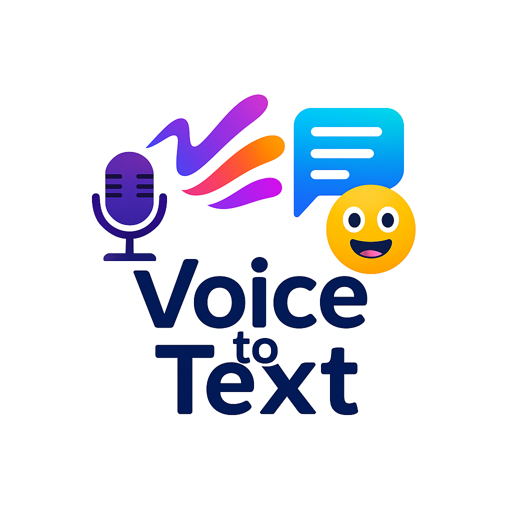

# 🎙️ Vocalink — Multilingual Voice-to-Text Transcription App

Vocalink is a real-time multilingual voice-to-text transcription web application built using JavaScript and Web APIs. It allows users to speak in over 20 different languages and get instant, emotion-aware textual transcriptions. The app enhances accessibility and inclusivity through intuitive UI, emotion detection, and download functionality.



## 🌐 Features

- 🔊 Real-time speech recognition using Web Speech API
- 🌍 Supports 20+ languages including Hindi, Marathi, Tamil, Chinese, Arabic, French, and more
- 😊 Emotion detection (Happy, Angry, Sad, Neutral) based on volume and pitch
- 💾 One-click transcript download
- 🎨 Clean, responsive UI with Bootstrap 5 and Google Fonts
- 🧠 Smart language selector that updates the UI text dynamically
- ⚙️ Built entirely with HTML, CSS, JavaScript (no backend required)

## 📸 Screenshot


## 🚀 How It Works

1. Select your preferred language from the dropdown.
2. Click “▶️ Start Listening” to activate the microphone.
3. Speak naturally — the app transcribes your words in real time.
4. Click “⏹️ Stop” when you're done.
5. Click “⬇️ Download Transcript” to save your speech as text.

## 🛠️ Technologies Used

| Technology     | Role                                      |
|----------------|-------------------------------------------|
| HTML/CSS       | Structure and responsive UI               |
| Bootstrap 5    | Styling and layout                        |
| JavaScript     | Core logic and functionality              |
| Web Speech API | Real-time speech recognition              |
| Web Audio API  | Emotion detection via pitch and volume    |

## 🌍 Supported Languages

- English 🇬🇧
- Hindi 🇮🇳
- Marathi 🇮🇳
- Tamil 🇮🇳
- Telugu 🇮🇳
- Kannada 🇮🇳
- Bengali 🇮🇳
- Gujarati 🇮🇳
- Malayalam 🇮🇳
- Punjabi 🇮🇳
- Urdu 🇵🇰
- Spanish 🇪🇸
- French 🇫🇷
- German 🇩🇪
- Russian 🇷🇺
- Arabic 🇸🇦
- Japanese 🇯🇵
- Chinese 🇨🇳
- Korean 🇰🇷
- Portuguese 🇵🇹

## 📂 Project Structure

vocalink/
├── index.html # Main UI
├── script.js # JavaScript logic (speech, emotion, translation)
├── logo.png # Application logo
├── screenshot.png # Demo image
└── README.md # Documentation


## 📦 Installation

1. Clone the repository:
   ```bash
   git clone https://github.com/your-username/vocalink-transcriber.git
   cd vocalink-transcriber
2. Open index.html in your browser (Google Chrome recommended).

Note: Microphone access is required. Some features may not work in unsupported browsers.

📥 Download Transcript
After transcription, click the “⬇️ Download Transcript” button to download the speech as a .txt file.

🎯 Use Cases
Assistive technology for the hearing impaired

Multilingual transcription for journalists and students

Interactive voice demos for language learning

Real-time speech capture for researchers and content creators

⚠️ Browser Compatibility
Browser	Supported
Chrome	✅
Edge (Chromium)	✅
Firefox	❌ (partial)
Safari	❌

🤝 Contributing
Pull requests are welcome. For major changes, please open an issue first to discuss what you would like to change.

📃 License
MIT License © 2025 Hrushikesh Harde